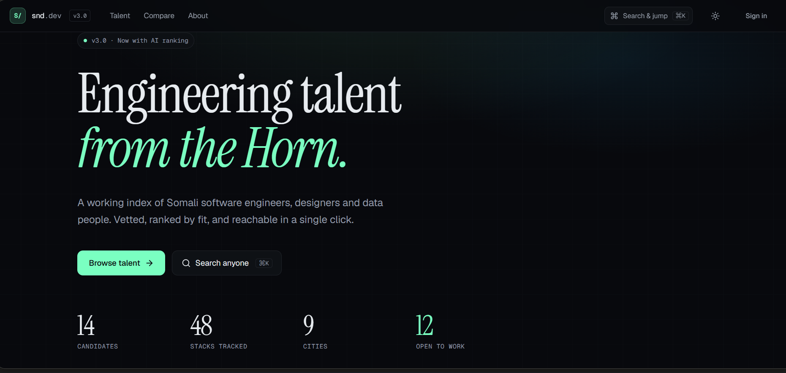

# Somali Network Developers (SND)

> A collaborative, open-source platform where Somali developers connect, showcase their work, and share insights.



---

## About

**SND** is fully open source. The entire source code lives in this repository — anyone can download it, run it locally, fork it, and push improvements back via pull requests.

The aim is to build this as a **community project**:

- Connect Somali developers across Mogadishu, Hargeisa, Nairobi, Addis, and the diaspora.
- Share insights, experience, and opportunities.
- Give employers and collaborators a clean way to discover engineering talent from the Horn.

If you're a Somali developer (or someone who wants to help the community), you are welcome to contribute — code, design, content, or ideas.

## Live app

- **Production**: https://somalinetworkdevelopers.lovable.app

## Tech stack

- **React 18** + **Vite** + **TypeScript**
- **Tailwind CSS** + **shadcn/ui**
- **Lovable Cloud** for backend (database, auth, storage, edge functions)
- **AI ranking** for candidate scoring

## Run locally

Requires Node.js and npm ([install with nvm](https://github.com/nvm-sh/nvm#installing-and-updating)).

```sh
# 1. Clone
git clone <YOUR_GIT_URL>
cd <YOUR_PROJECT_NAME>

# 2. Install
npm install

# 3. Start dev server
npm run dev
```

The app runs at `http://localhost:8080`.

## Project structure

```
src/
  pages/           # Landing, Talent console, Profile, Compare, Admin
  components/      # UI, console, layout, candidate components
  integrations/    # Auto-generated backend client
supabase/
  functions/       # Edge functions (AI scoring, CV signed URLs, email)
  migrations/      # Database schema history
docs/              # Screenshots and assets used by the README
```

## Contributing

Contributions are very welcome. The typical flow:

1. **Fork** this repository on GitHub.
2. Create a branch: `git checkout -b feat/your-idea`.
3. Commit your changes with a clear message.
4. Push and open a **Pull Request** describing what you changed and why.

You can also contribute without cloning the repo — open the project in [Lovable](https://lovable.dev) and edit visually. Changes sync back to GitHub automatically.

Ideas that are always appreciated:

- New candidate profiles (real Somali developers who want to be listed).
- UI/UX polish and accessibility fixes.
- Documentation and translations (Somali, Arabic, English).
- New features: shortlists, messaging, employer accounts, events board.

## Issues & discussions

Found a bug or have an idea? Open a GitHub Issue. For bigger conversations (roadmap, community, design direction), start a Discussion.

## License

Open source. Free to use, learn from, and build on.
